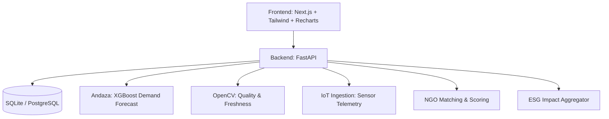

# RasoiIQ — Predict. Rescue. Redistribute.

**Problem Statement:** SIH26234 — AI-powered food waste reduction and rescue redistribution platform for institutional kitchens and food processing units.

## Solution Overview

RasoiIQ is a comprehensive end-to-end platform designed to minimize institutional food waste. By integrating predictive demand modeling (Andaza), computer vision for food quality checks, real-time IoT processing unit monitoring, and an automated NGO matching and routing engine, RasoiIQ ensures that rescue food is quickly verified, securely rescued, and efficiently redistributed to those in need.

## Key Features

- **Food Quality Check (Computer Vision):** Uses OpenCV to rapidly assess food freshness via color variance and dark-spot detection, automatically escalating urgency for near-spoilage items.
- **ESG & Sustainability Analytics:** Real-time dashboards calculating kilograms of food saved, equivalent meals donated, CO2e emissions avoided, and financial savings. Includes one-click PDF reporting.
- **Processing Unit Monitor (Simulated IoT):** An active ingestion API (`/iot/ingest`) tracks live telemetry (temperature, humidity, downtime, energy) and triggers rule-based alerts to prevent spoilage at the source.
- **Andaza AI Forecasts:** XGBoost-powered demand forecasting using historical consumption, climatology, and local events to optimize initial production and prevent overcooking.
- **Intelligent NGO Matching & Routing:** Automatically ranks nearby verified NGOs based on real-time distance and capacity, generating optimized delivery waypoints.

## Architecture Diagram



## Tech Stack

- **Backend:** Python, FastAPI, SQLAlchemy, Pydantic
- **AI/ML & CV:** XGBoost, Scikit-Learn, OpenCV, Pandas, NumPy
- **Frontend:** Next.js 14, React, Tailwind CSS, Recharts, MapLibre GL
- **Database:** SQLite (Default for demo) / PostgreSQL

## Windows Setup Steps

**The backend must run on port 8080** — the frontend is hardcoded to
`http://127.0.0.1:8080` in `frontend/src/lib/api.ts`. Running it on any other
port leaves every dashboard blank.

### First-time setup (do once)

```powershell
# 1. Backend virtual environment
cd backend
python -m venv venv
.\venv\Scripts\activate
pip install -r requirements.txt
cd ..

# 2. Train the Andaza demand model
#    Produces models/andaza_xgb_poisson.json. Without it, /andaza/forecast
#    returns HTTP 503 and the Andaza charts are empty.
python train_andaza.py

# 3. Seed the database
cd backend
python -m scripts.seed_data        # kitchens, categories, consumption, rescue events, ESG
python -m scripts.seed_andaza      # demand history for the Andaza lag features
cd ..
```

`models/andaza_xgb_poisson.json` is a build artifact of step 2. If it is
missing, re-run `python train_andaza.py` — it takes about a minute.

### Every time you want to run it

Double-click **`start.bat`** in the repo root. It opens both terminals.

Or run them by hand, in two terminals:

```powershell
# Terminal 1 — backend
cd backend
.\venv\Scripts\activate
python -m uvicorn app.main:app --host 0.0.0.0 --port 8080 --reload
```

```powershell
# Terminal 2 — frontend
cd frontend
npm install      # only needed the first time
npm run dev
```

Then open:

| URL | What |
| --- | --- |
| `http://localhost:3000` | Application |
| `http://localhost:8080/docs` | Interactive API docs |
| `http://localhost:8080/health` | Backend health check |

The sidebar shows a live backend indicator, so you can confirm both halves are
up from the UI.

### Notes

- **SQLite is CWD-relative.** `DATABASE_URL` defaults to `sqlite:///./test.db`,
  so always start uvicorn from inside `backend/`, otherwise you get a second
  empty database in the repo root.
- **Both servers are required.** There is no SSR data fetching, so a stopped
  backend shows empty panels rather than an error page.
- **Optional:** set `GEMINI_API_KEY` in `backend/.env` to enable the AI
  narrative on the sustainability report. Without it that section is simply
  skipped.
- To start from a clean database, delete `backend/test.db` and re-run both seed
  scripts in step 3.

## Demo Credentials

_Note: The platform is currently configured in a demonstration mode without strict multi-role authentication enabled. You will automatically land on the SysAdmin dashboard._

## Screenshots

_(Insert screenshots of the Dashboard, Quality Check, ESG Report, and IoT Monitor here)_

---

## Acknowledgements

get helped by open-source project (https://github.com/Garv1105/AI-Powered-Food-Reduction-and-Rescue-Distribution-Management). Original LICENSE retained.
